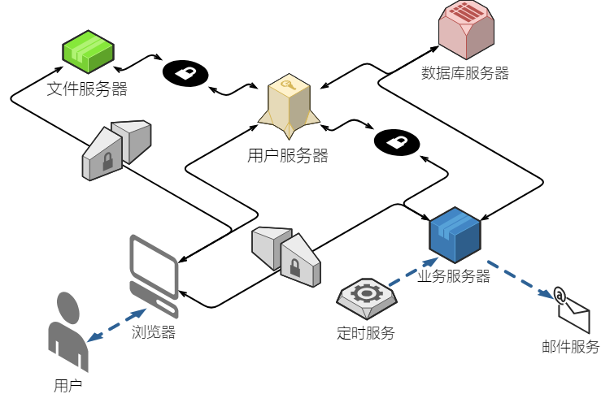
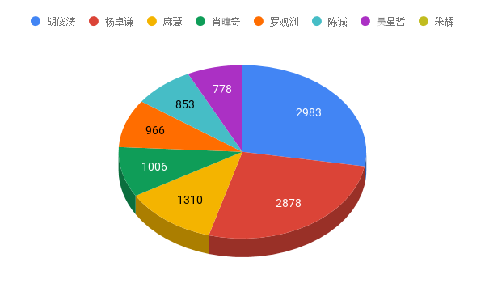

# Conference Center

> Frontend project for Conference Center.

北航 软院 9人 7天 敏捷

## Architecture



## Workload



## Build Setup

``` bash
# install dependencies
# npm install
# 除非要新增包，否则加--no-save啦啦啦
npm install --no-save

# serve with hot reload at localhost:8080
npm run dev

# build for production with minification
npm run build

# build for production and view the bundle analyzer report
npm run build --report

# run unit tests
npm run unit

# run all tests
npm test
```

For a detailed explanation on how things work, check out the [guide](http://vuejs-templates.github.io/webpack/) and [docs for vue-loader](http://vuejs.github.io/vue-loader).

